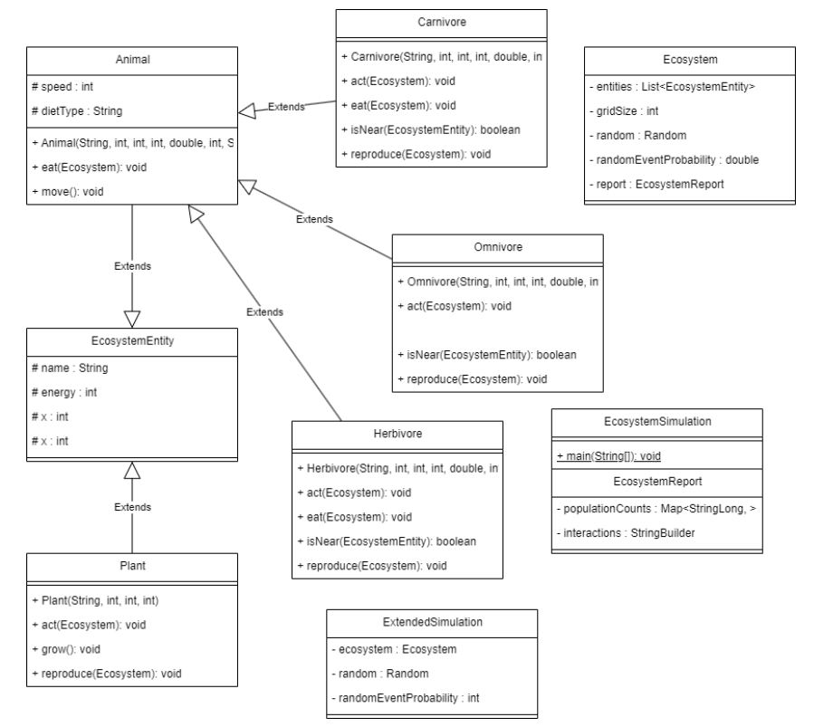
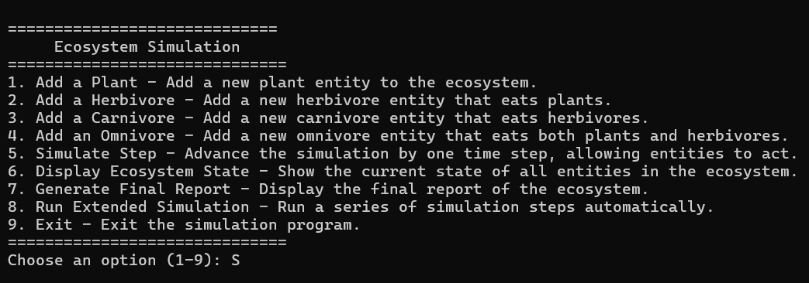
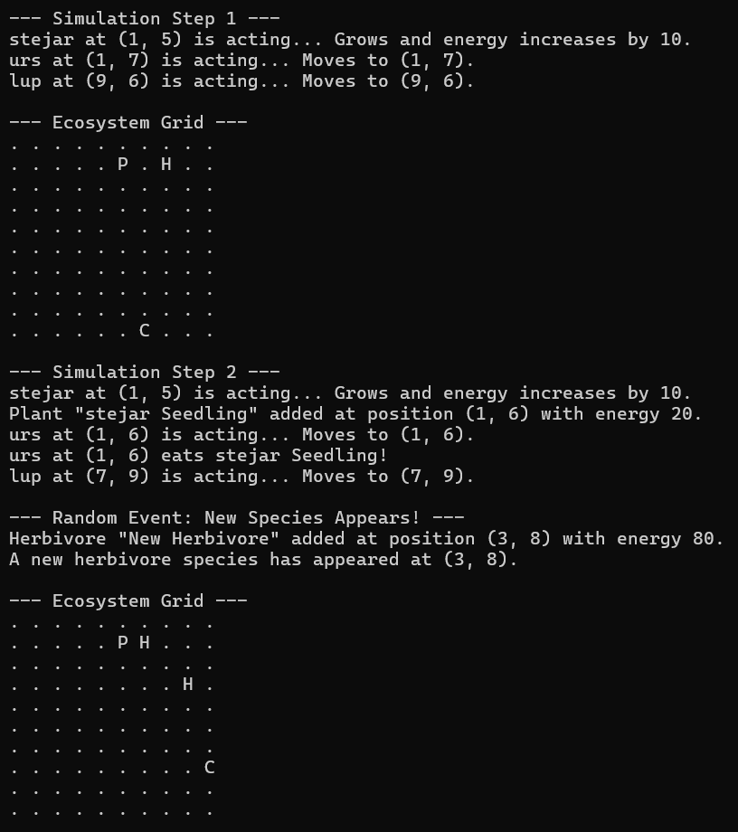
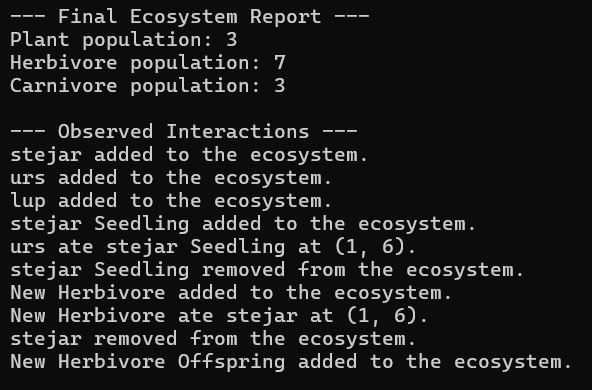

## Ecosystem Simulation Project

This project simulates an ecosystem with various entities, such as plants, herbivores, carnivores, and omnivores. The simulation allows for the interaction of these entities within a grid, showcasing how they affect each other's survival and growth.

## Installation Instructions
Clone the repository:
```bash
git clone https://github.com/scienceagent/oop_laboratory.git
```
Navigate to the project directory:
```bash
cd EcosystemSimulation
```
Install dependencies (if any):
```bash
npm install
```

## Folder Structure

The workspace contains two folders by default, where:

- `src`: the folder to maintain sources
- `lib`: the folder to maintain dependencies

## Class Descriptions
### 1. Ecosystem
- **Description**: Manages the simulation environment, including the entities and their interactions.
- **Hierarchy**: Base class for managing the overall ecosystem. Contains methods for adding entities and simulating steps.

### 2. EcosystemEntity (Abstract Class)
- **Description**: Represents a generic entity in the ecosystem, which could be a plant, herbivore, carnivore, or omnivore.

|Subclasses  |Description  |Attributes  |
|---------|---------|---------|
|Plant     |     Represents a plant entity that can be eaten by herbivores.    | name - The name of the plant <br/> energy: The energy level of the plant.  <br/>  x, y: Coordinates in the simulation grid.   |
|Herbivore     |    Represents a herbivore that consumes plants.     |  Inherits from EcosystemEntity. <br/>   Additional attributes for speed and behavior.    |
|Carnivore     | Represents a carnivore that consumes herbivores.        |   Inherits from EcosystemEntity. <br/>  Additional attributes for hunting behavior.    |
|Omnivore     |  Represents an omnivore that can consume both plants and herbivores.       |   Inherits from EcosystemEntity. <br/>  Additional attributes for varied diet behavior.     |


## Method Explanations
### Ecosystem
- `addEntity(EcosystemEntity entity)`: Adds an entity (plant, herbivore, carnivore, or omnivore) to the ecosystem.
- `simulateStep()`: Advances the simulation by one time step, allowing entities to act and interact.
- `displayState()`: Displays the current state of all entities in the ecosystem.

### EcosystemEntity
- `isAlive()`: Returns whether the entity is still alive based on its energy level.
- `act(Ecosystem ecosystem)`: Abstract method to be implemented by subclasses, defining how the entity behaves during a simulation step.

### Plant
- `act(Ecosystem ecosystem)`: Defines behavior for plants, such as growing or reproducing.

### Herbivore
- `act(Ecosystem ecosystem)`: Implements behavior for herbivores, such as eating plants and moving.

### Carnivore
- `act(Ecosystem ecosystem)`: Implements behavior for carnivores, such as hunting herbivores.

### Omnivore
- `act(Ecosystem ecosystem)`: Implements behavior for omnivores, allowing them to consume both plants and herbivores.

## UML Diagram


## Usage Scenarios
### Program menu

### Program simulation steps

### Program observed interactions


## Difficulties Encountered

|Difficulty  |Solution  |
|---------|---------|
|Managing entity interactions during simulation steps.     |   Implemented a clear method for handling interactions and ensuring that entities acted in a defined order.      |
|Ensuring proper energy management for entities.     |   Developed a consistent method for updating energy levels based on consumption and actions taken.      |

## Future Improvements
`- Implement a graphical user interface (GUI) for better user interaction.`
`- Add more complex behaviors and interactions among entities.`