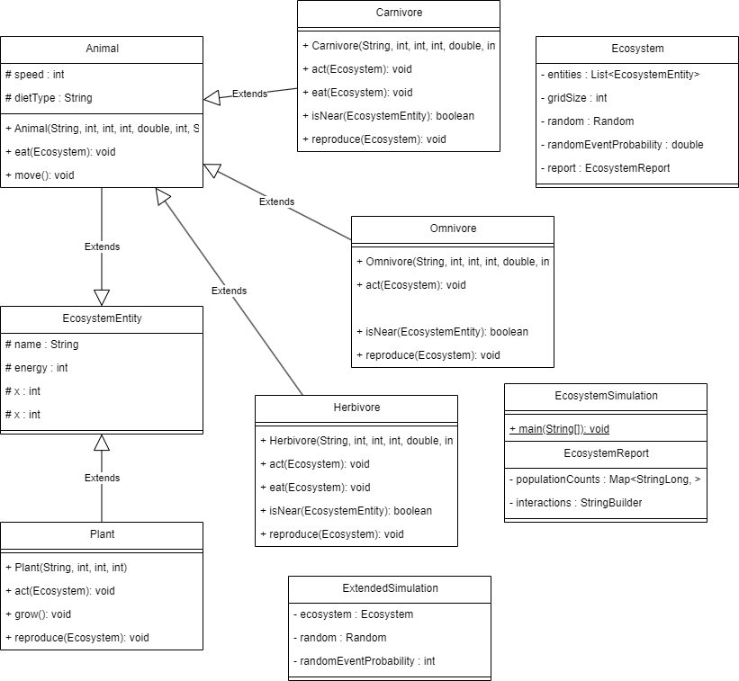

<!DOCTYPE html>
<html lang="en">
<head>
    <meta charset="UTF-8">
    <meta name="viewport" content="width=device-width, initial-scale=1.0">
    <title>Ecosystem Simulation Project</title>
    
</head>
<body>
    <header>
        <h1>Ecosystem Simulation Project</h1>
        
A Java program simulating the interactions of plants, herbivores, carnivores, and omnivores in an ecosystem.

    </header>
    <section>
        <h2>Folder Structure</h2>
        <ul>
            <li><strong>src</strong>: The folder to maintain sources</li>
            <li><strong>lib</strong>: The folder to maintain dependencies</li>
        </ul>
    </section>
    <section>
        <h2>Class Descriptions</h2>
        <h3>1. Ecosystem</h3>
        
<strong>Description:</strong> Manages the simulation environment, including the entities and their interactions.

        
<strong>Hierarchy:</strong> Base class for managing the overall ecosystem. Contains methods for adding entities and simulating steps.

        <h3>2. EcosystemEntity (Abstract Class)</h3>
        
<strong>Description:</strong> Represents a generic entity in the ecosystem, which could be a plant, herbivore, carnivore, or omnivore.

        <table>
            <thead>
                <tr>
                    <th>Subclasses</th>
                    <th>Description</th>
                    <th>Attributes</th>
                </tr>
            </thead>
            <tbody>
                <tr>
                    <td>Plant</td>
                    <td>Represents a plant entity that can be eaten by herbivores.</td>
                    <td>name, energy, x, y</td>
                </tr>
                <tr>
                    <td>Herbivore</td>
                    <td>Represents a herbivore that consumes plants.</td>
                    <td>speed, behavior</td>
                </tr>
                <tr>
                    <td>Carnivore</td>
                    <td>Represents a carnivore that consumes herbivores.</td>
                    <td>hunting behavior</td>
                </tr>
                <tr>
                    <td>Omnivore</td>
                    <td>Represents an omnivore that can consume both plants and herbivores.</td>
                    <td>varied diet behavior</td>
                </tr>
            </tbody>
        </table>
    </section>
    <section>
        <h2>Method Explanations</h2>
        <h3>Ecosystem</h3>
        <ul>
            <li><code>addEntity(EcosystemEntity entity)</code>: Adds an entity to the ecosystem.</li>
            <li><code>simulateStep()</code>: Advances the simulation by one time step.</li>
            <li><code>displayState()</code>: Displays the current state of all entities in the ecosystem.</li>
        </ul>
        <h3>EcosystemEntity</h3>
        <ul>
            <li><code>isAlive()</code>: Returns whether the entity is still alive based on its energy level.</li>
            <li><code>act(Ecosystem ecosystem)</code>: Abstract method defining entity behavior.</li>
        </ul>
        <section>
    <h2>Method Explanations</h2>
    <h3>Ecosystem</h3>
    <ul>
        <li><code>addEntity(EcosystemEntity entity)</code>: Adds an entity to the ecosystem.</li>
        <li><code>simulateStep()</code>: Advances the simulation by one time step.</li>
        <li><code>displayState()</code>: Displays the current state of all entities in the ecosystem.</li>
    </ul>
    <h3>EcosystemEntity</h3>
    <ul>
        <li><code>isAlive()</code>: Returns whether the entity is still alive based on its energy level.</li>
        <li><code>act(Ecosystem ecosystem)</code>: Abstract method defining entity behavior.</li>
    </ul>
    <h3>Plant</h3>
    <ul>
        <li><code>act(Ecosystem ecosystem)</code>: Defines the behavior of plants, such as growing or reproducing in the ecosystem.</li>
    </ul>
    <h3>Herbivore</h3>
    <ul>
        <li><code>act(Ecosystem ecosystem)</code>: Implements behavior for herbivores, such as seeking and consuming plants, and moving within the ecosystem.</li>
    </ul>
    <h3>Carnivore</h3>
    <ul>
        <li><code>act(Ecosystem ecosystem)</code>: Defines behavior for carnivores, including hunting herbivores and managing energy consumption during movement and hunting.</li>
    </ul>
    <h3>Omnivore</h3>
    <ul>
        <li><code>act(Ecosystem ecosystem)</code>: Implements behavior for omnivores, allowing them to consume both plants and herbivores, with logic to prioritize based on proximity or energy needs.</li>
    </ul>
</section>
    </section>
    <section>
        <h2>UML Diagram</h2>
        
    </section>
    <section>
        <h2>Usage Scenarios</h2>
        
        
        
    </section>
    <section>
        <h2>Difficulties Encountered</h2>
        <table>
            <thead>
                <tr>
                    <th>Difficulty</th>
                    <th>Solution</th>
                </tr>
            </thead>
            <tbody>
                <tr>
                    <td>Managing entity interactions during simulation steps.</td>
                    <td>Implemented a clear method for handling interactions and ensuring that entities acted in a defined order.</td>
                </tr>
                <tr>
                    <td>Ensuring proper energy management for entities.</td>
                    <td>Developed a consistent method for updating energy levels based on consumption and actions taken.</td>
                </tr>
            </tbody>
        </table>
    </section>
</body>
</html>
